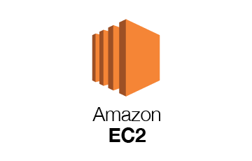

# Amazon EC2

_"Amazon Elastic Compute Cloud (Amazon EC2) offers the broadest and deepest compute platform with over 475 instances and the ability to choose the latest processor, storage, networking, operating system and purchasing model to help you best fit your workload needs. (...)"_

It is one of the most popular AWS services and offers on-demand computing capacity through different modalities, offering high performance and horizontal scalability.

- One of the most popular AWS Offering
- It mainly consists in the capability of
  - Renting virtual machines (EC2)
  - Storing data on virtual drives (EBS)
  - Distributing load across machines
  - Scaling the services using an auto-scaling group (ASG)

---

## ⚙️ EC2 Configuration options

EC2 Instances have multiple configuration options, some of them will have direct influence in the final service billing, other will be free but only accessible once you have at least one instance running.

- Operating systems (OS): Linux, Windows or Mac
- How much compute power and cores (CPU)
- How much Random Access Memory (RAM)
- How much storage space:
  - Network-attached (EBS & EFS)
  - Hardware (EC2 Instance Store)
- Network card: Speed of the card, Public IP address (Elastic Addresses)
- Firewall rules (EC2 Security Groups)
- Bootstrap script (Configure at first launch): EC2 User Data

---

## 👤 EC2 User Data

> > Bootstrap scripts are a set of launching commands that be executed once an EC2 Instance is launched for first time.

- It is possible to bootstrap our instances using an EC2 User data script.
- EC2 User data is used to automate boot tasks such as
  - Installing updates
  - Installing software
  - Downloading common files from the internet
  - Etc.
- <ins>The EC2 User Data Script runs under root user (user root) privileges.</ins>

---

## 🖥️ EC2 Instance types

"Amazon EC2 provides a wide selection of instance types optimized to fit different use cases. Instance types span various combinations of CPU, memory, storage, and networking capacity. They give you flexibility to choose the right combination of resources for your applications."

### \* General purposes

_General-purpose instances provide a balanced mix of computing, memory and network resources._

- Web Servers
- Code repositories

### \* Compute optimized

_Las instancias optimizadas para informática son ideales para las aplicaciones que dependen de los recursos informáticos y se benefician de los procesadores de alto rendimiento._

- Batch Processing Workloads
- Media transcoding
- High performance web servers
- High performance computing (HPC)
- Scientific modeling and ML
- Dedicated Gaming Servers

### \* Memory Optimized

_Memory optimized instances are designed to provide fastest performance for heavy workloads that processes large data sets in memory._

- High performance, relational/non-relational databases
- Distributed web scale cache stores
- In-memory databases optimized for BI
- Applications performing real-time processing of big unstructured data

### \* Accelerated Computing

_In accelerated computing instances hardware accelerators and co-processors are used to perform tasks, such as calculating floating point numbers, processing graphics or searching for data patterns matches._

- Calculation of floating point numbers
- Graph processing
- Data pattern matching

### \* Storage Optimized

_Storage optimized instances are designed for workloads that require high sequential read and write access to very large data sets on local storage._

- Highly available OnLine Transaction Processing (OLTP) systems
- Relational & NOSQL Databases
- Cache for in-memory databases (e.g Redis)
- Data warehousing applications
- Distributed filesystems

More information at: https://aws.amazon.com/es/ec2/instance-types/?nc1=h_ls

---

## ✏️ EC2 Instances Naming Convention

| Instance    | vCPU | Mem (GiB) | Storage        | Network performance | EBS Bandwidth (Mbps) |
| ----------- | ---- | --------- | -------------- | ------------------- | -------------------- |
| t2.micro    | 1    | 1         | EBS-Only       | Low to moderate     |                      |
| t2.xlarge   | 4    | 16        | EBS-Only       | Moderate            |                      |
| c5d.4xlarge | 16   | 32        | 1x400 NVME SSD | Up to 10 Gbps       | 4750                 |
| r5.16xlarge | 64   | 512       | EBS-Only       | 20 Gbps             | 13600                |
| m5.8xlarge  | 32   | 128       | EBS-Only       | 10 Gpbs             | 6800                 |

---

## 💾 EC2 AMI

Amazon Machine Image is a repository provided by aws to find public (shared by relevant vendors, or config made by yourself) and specific EC2 customization setups.

What AMI is:

- Add your own software, configuration, OS, monitoring tools,etc.
- Faster boot configuration time because all your software is pre packaged
- AMI are built for and specific region (and can be copied across regions)

You can launch AMI from:

- Public AMI provided by AWS
- Your own AMI made and maintained by yourself
- AWS Marketplace AMI (AMI someone else built, and probably sells)

> IMPORTANT: “AMIs are built for a specific AWS Region, they're unique for each AWS Region. You can't launch an EC2 instance using an AMI in another AWS Region, but you can copy the AMI to the target AWS Region and then use it to create your EC2 instances.”

---

## EC2 Security Groups & Classic Ports

- Security groups are the fundamental of networking security in AWS
- They control how traffic is allowed into or out of our EC2 Instances
- They only contain Allow rules
- Can reference by IP or by Security Group

- SG are acting as a network “firewall” on our EC2 Instances
- They regulate:
  - Access to Ports
  - Authorized IP Ranges (IPv4, IPV6)
  - Control of inbound network
  - Control of outbound network

- SG Can be attached to multiple instances
- Locked down to a region / VPC combination
- Does it live “outside” the EC2 - if traffic is blocked the EC2 Instance won’t see it at all
- It’s good to maintain one separate Security Group for SSH access
- If your app is not accesible (timeout), then its (probably) a security group issue.

- All inbound traffic is blocked by default
- All outbound traffic is authorized by default

### Security Groups classic ports

### SSH Support

---

## 💵 EC2 Instances Purchasing Options

- **On-Demand Instances**: Short workload and predictable pricing.

  - Pay for what you use
  - Linux/Windows - billing per second, after the first minute
  - All other OS - billing per hour
  - The highest cost but no upfront payment
  - No long-term commitment

---

- **Reserved Instances(Minimum 1 year)**:

  - Up to 75% discount compared to On-demand
  - Reservation period: 1 year = + discount / 3 years = +++ discount
  - Purchasing options -> no upfront / partial upfront = + / All upfront = ++ discount
  - Reserved for steady-state usage apps (like databases)

---

- **Scheduled Reserved Instances**:
  - Convertible Reserved Instances: (Long workload with flexible instances)
  - Can change the EC2 Instance type
  - Up to 54% discount
  - Scheduled Reserved Instances: Example - (e.g every Thursday between 3 and 6 pm)
  - Launch within time window you reserve
  - When you require fraction of day/week/month \* Still commitment over 1 to 3 years

---

- **Spot Instances**: Short workloads, cheap, can lose instances
  - Can get a discount of up to 90% compared to On-Demand
  - Instances that you can “lose” at any point of time if your max price is less than the current spot price
  - Useful for workloads that are resilient to failure
    - Batch jobs
    - Data analysis
    - Image processing
    - Any distributed workloads
    - Not situable for critical jobs or databases

---

- **Dedicated Hosts:** (book an entire physical server, control instance placement)
  - Dedicated Hosts can help you address compliance requirements and reduce costs by allowing you to use your existing server-bound software licenses
  - Allocated for your account for a 3-year period reservation
  - More expensive
  - Useful for software that have complicated licensing model (BYOL - Bring Your Own License)
  - Or for companies that have strong regulatory or compliance needs

### Source info

AWS EC2 documentation provide fine grained details about EC2 Purchasing options:

- [AWS EC2 Purchasing options](https://docs.aws.amazon.com/AWSEC2/latest/UserGuide/instance-purchasing-options.html)
- [On-Demand Instances](https://docs.aws.amazon.com/AWSEC2/latest/UserGuide/ec2-on-demand-instances.html)
- [Reserved Instances](https://docs.aws.amazon.com/AWSEC2/latest/UserGuide/ec2-reserved-instances.html)
- [Scheduled Reserved Instances](https://docs.aws.amazon.com/AWSEC2/latest/UserGuide/ec2-scheduled-instances.html)
- [Spot Instances](https://docs.aws.amazon.com/AWSEC2/latest/UserGuide/using-spot-instances.html)
- [Dedicated Hosts](https://docs.aws.amazon.com/AWSEC2/latest/UserGuide/dedicated-hosts-overview.html)
- [Dedicated Instances](https://docs.aws.amazon.com/AWSEC2/latest/UserGuide/dedicated-instance.html)

---

## 🗄️ EC2 Dedicated instances vs Dedicated Hosts

AWS differentiates between the performance of its two service modes for Amazon EC2

- Host
- Instance

_“An important difference between a Dedicated Host and a Dedicated Instance is that a Dedicated Host gives you additional visibility and control over how instances are placed on a physical server, and you can consistently deploy your instances to the same physical server over time(...)”._

That is, AWS thus marks the customer's level of control over how instances are deployed across their hosts (Physical server), whether they prefer it in a shared or isolated manner.

- Instances running on hardware that’s dedicated to you
- May share hardware with other instances in same account
- No control over instance placement (can move hardware after Stop/Start)

### EC2 Pricing Comparison

---

| Previous                                    |     |     |     |     | Next                             |
| ------------------------------------------- | --- | --- | --- | --- | -------------------------------- |
| [AWS PowerShell](../security/powershell.md) |     |     |     |     | [AWS EBS](../storage/aws-ebs.md) |
