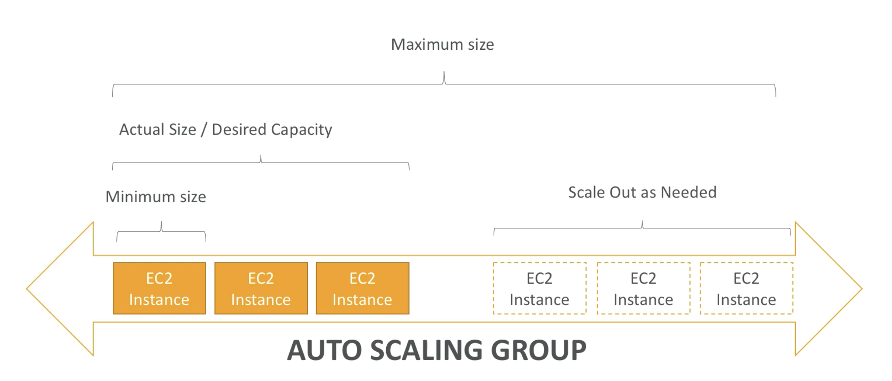
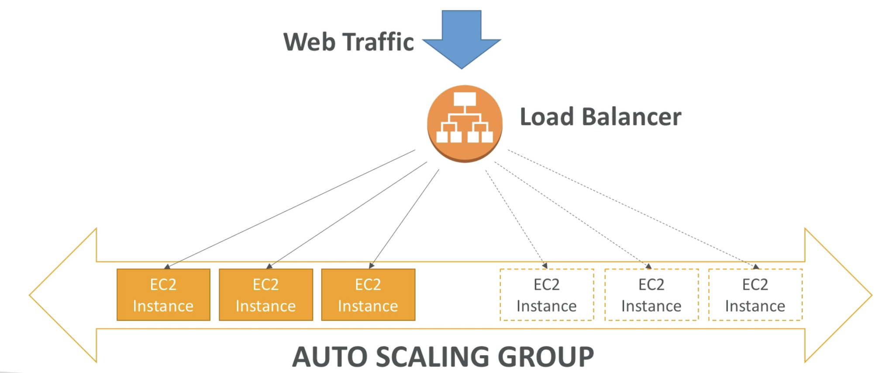
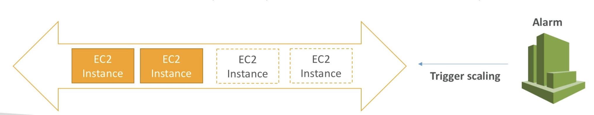
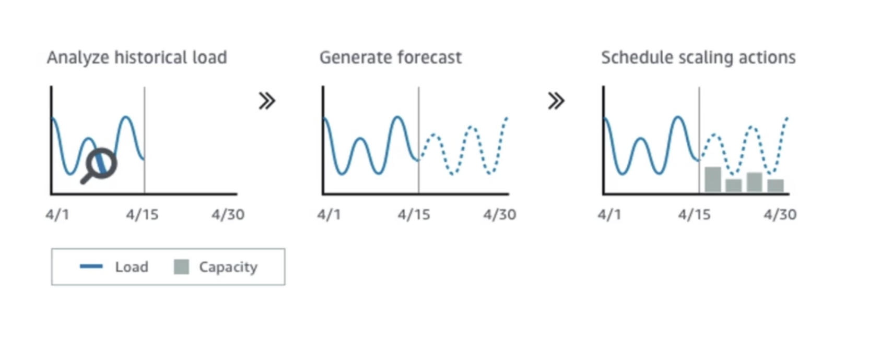
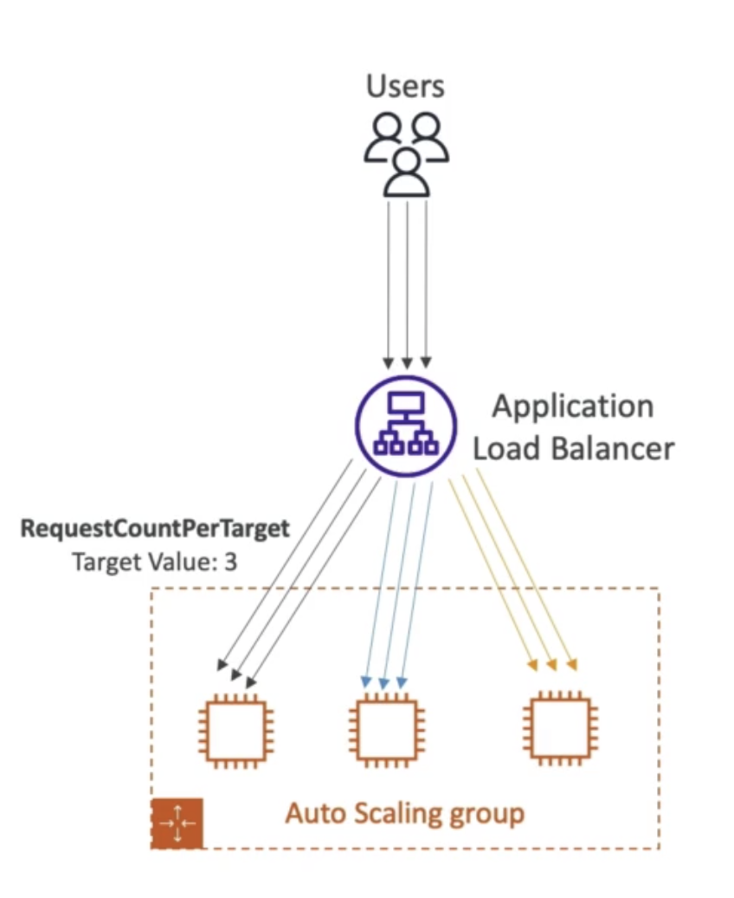
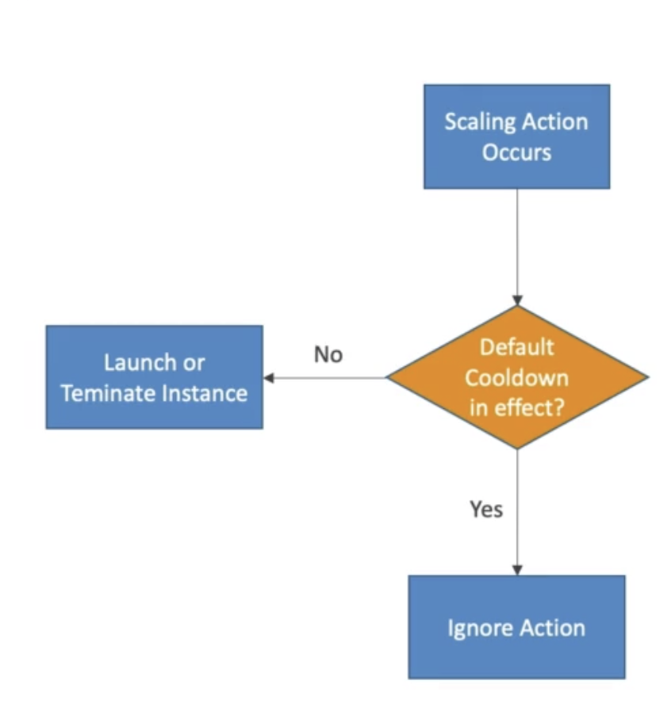

# Auto Scaling Groups (ASG)

 

 

_“An Amazon EC2 Auto Scaling Group (ASG) contains a set of EC2 instances that share similar characteristics and are treated as a logical grouping for fleet management and dynamic scaling purposes.”._

- [Visit the official service webpage](https://aws.amazon.com/es/autoscaling/)
- [Visit complete api documentation](https://docs.aws.amazon.com/autoscaling/?id=docs_gateway)
- [Visit the official user guide](https://docs.aws.amazon.com/autoscaling/ec2/userguide/auto-scaling-groups.html)

 

---

 

_"In real-life, the load on your websites and application can change. In the cloud, you can create and get rid of servers very quickly."._

The main goals of an Auto Scaling Group is to:

- **Scale out** (add EC2 instances) to match an increased load
- **Scale in** (remove EC2 instances) to match a decreased load
- Ensure we have a minimum and a maximum number of machines running
- Automatically Register new instances to load balancer

 

_Lets see an example:_

- **Minimum size**: In this case is the number of EC2 instances you’ll have sure running in your ASG (and to ensure you are providing your cervices to your client/bussiness needs)
- **Actual size/desired capacity**: Is the number of the EC2 instances running at the current moment in ASG
- **Scale out as needed**: How many instances can be added for scale out if needed when the loads goes out

 

 

**The load balancer will know how to redirect traffic based on registered targets and doing health checks**

 

 

---

 
 

## ⚙️ ASG Attributes

 

1. Launch Configuration
   - AMI + Instance type
   - EC2 User Data
   - EBS Volumes
   - Security Groups
   - SSH Key Pair
2. Min Size/Max Size/Initial Capacity
3. Network + Subnets information
4. Load Balancer Information
5. Scaling Policies

 

---

 
 

## ⏰ Auto Scaling Alarms

 

<ins>It is possible to scale an ASG based on _CloudWatch Alarms_, an alarm monitors a metric (such as Average CPU) and these are computed for overall ASG Instances.</ins>

Based on alarms:

- We can create scale-out policies (increase the number of instances)
- We can create scale-in policies (decrease the number of instances)

 

 

---

 
 

## 🛂 Auto Scaling New Rules

 

It is now possible to define better auto scaling rules that are directly managed to EC2:

- Target Average CPU usage
- Number of requests on the ALB <ins>per instance</ins>
- Average Network In
- Average Network Out

These rules are easier to setup and can make more sense.

 

---

 
 

## 🔧 Auto Scaling Custom Metrics

 

We can auto scale based on a custom metric (ex: number of connected users):

1. Send custom metric from application living on EC2 instance to CloudWatch (PutMetric API)
2. Create CloudWatch alarm to react to low/high values
3. Use the CloudWatch alarm as the scaling policy for ASG

 

---

 
 

## 🧠 ASG Brain Dump

 

- Scaling policies can be up on CPU, Network… and can even be on custom metrics or based on a schedule (if you know your visitors patterns)
- ASG use [Launch configurations](https://docs.aws.amazon.com/autoscaling/ec2/userguide/launch-configurations.html) or [Launch Templates (newer)](https://docs.aws.amazon.com/autoscaling/ec2/userguide/launch-templates.html).
- To update an ASG, you must provide a new launch configuration / launch template
- IAM roles attached to an ASG will get assigned to EC2 instances
- ASG are free. You pay for the underlying resources being launched
- Having instances under an ASG means that if they get terminated for whatever reason, the ASG will automatically create new ones as a replacement.
- ASG can terminate instances marked as unhealthy by an LB (and hence replace them)

 

---

 
 

## 👁️ ASG Dynamic Scaling Policies

 

There are three types of scaling types, based on their scaling policies:

### Target Tracking Scaling

- Most simple and easy to set-up
- Example: I want the average ASG CPU to stay around 40%

 

### Simple / Step Scaling

- When a CloudWatch alarm is triggered (ex: AVG CPU > 70%), then add 2 units
- When a CloudWatch alarm is triggered (ex: AVG CPU < 30%), then remove 1

 

### Scheduled Actions

- Anticipate a scaling based on known usage patterns
- Example: Increase the minimum capacity to 10 at 5pm on Fridays

 

### Predictive Scaling

- Continuously forecast load and schedule scaling ahead
- Relying on ML and predictive models based on historical data from CloudWatch
- The ML algorithm consumes the available data and calculates capacity that best fits the historial load pattern
- Learns based on new data to make future forecasts

 

 

---

 
 

## ✅ Good metrics to scale on

 

- **CPUUtilization**: Average CPU utilization across your instances
- **RequestCountPerTarget**: To make sure the number of requests per EC2 instances is stable
- **Average Network In / Out** (if you’re application is network bound)
- **Any custom metric** (that you push using CloudWatch)
- See the complete list of metrics available at: https://docs.aws.amazon.com/AWSEC2/latest/UserGuide/viewing_metrics_with_cloudwatch.html

 

 

---

 
 

## 🕞 ASG Scaling cooldowns

- After scaling activity happens, you are in the cooldown period (300 seconds by default)
- During the cooldown period, the ASG will not launch or terminate additional instances (to allow for metrics to stabilize)
- Advice: Use a ready-to-use AMI to reduce configuration time in order to be serving requests faster and reduce the cooldown period.

 

 

---

 
 

## ✏️ IMPORTANT NOTES FOR EXAM

 

- Only Network Load Balancer provides both static DNS name and static IP. While, Application Load Balancer provides a static DNS name but it does NOT provide a static IP. The reason being that AWS wants your Elastic Load Balancer to be accessible using a static endpoint, even if the underlying infrastructure that AWS manages changes.

- ELB Sticky Session feature ensures traffic for the same client is always redirected to the same target (e.g., EC2 instance). This helps that the client does not lose his session data.

- When using an Application Load Balancer to distribute traffic to your EC2 instances, the IP address you'll receive requests from will be the ALB's private IP addresses. To get the client's IP address, ALB adds an additional header called X-Forwarded-For contains the client's IP address.

- When you enable ELB Health Checks, your ELB won't send traffic to unhealthy (crashed) EC2 instances.

- Network Load Balancer provides the highest performance and lowest latency if your application needs it.

- Network Load Balancers support both TCP and UDP protocols. (ALB don’t)

- ALBs can route traffic to different Target Groups based on URL Path, Hostname, HTTP Headers, and Query Strings.

- Network Load Balancer has one static IP address per AZ and you can attach an Elastic IP address to it. Application Load Balancers and Classic Load Balancers as a static DNS name.

- The following cookie names are reserved by the ELB (AWSALB, AWSALBAPP, AWSALBTG).

- When Cross-Zone Load Balancing is enabled, ELB distributes traffic evenly across all registered EC2 instances in all AZs.

- Server Name Indication (SNI) allows you to expose multiple HTTPS applications each with its own SSL certificate on the same listener. Read more here: https://aws.amazon.com/blogs/aws/new-application-load-balancer-sni/

- The Auto Scaling Group can't go over the maximum capacity (you configured) during scale-out events.

- You can configure the Auto Scaling Group to determine the EC2 instances' health based on Application Load Balancer Health Checks instead of EC2 Status Checks (default). When an EC2 instance fails the ALB Health Checks, its marked unhealthy and will be terminated while the ASG launches a new EC2 instance.ç

- There's no CloudWatch Metric for "requests per minute" for backend-to-database connections. You need to create a CloudWatch Custom Metric, then create a CloudWatch Alarm.

- This is the most secure way of ensuring only the ALB can access the EC2 instances. Referencing by security groups in rules is an extremely powerful rule and many questions at the exam rely on it. Make sure you fully master the concepts behind it!

- For each Auto Scaling Group, there's a Cooldown Period after each scaling activity. In this period, the ASG doesn't launch or terminate EC2 instances. This gives time to metrics to stabilize. The default value for the Cooldown Period is 300 seconds (5 minutes).

 

---

 

| Previous                |     |     |     |     | Next                             |
| ----------------------- | --- | --- | --- | --- | -------------------------------- |
| [AWS ELB](./aws-elb.md) |     |     |     |     | [AWS RDS](../storage/aws-rds.md) |
