# Amazon ELB

 

_“Elastic Load Balancing (ELB) automatically distributes incoming application traffic among various destinations and virtual devices in one or more Availability Zones (AZs) (...)”._

---

 
 

## Vertical vs Horizontal Scalability

Scalability means that an application / system can handle greater loads by adapting. There two kind of scalability:

- Vertical scalability
- Horizontal scalability (= elasticity)

<ins>Scalability is linked but different to High Availability.</ins>

**Vertical scalability means increasing the size of an EC2 Instance. For example your application runs on a t2.micro ands scaling that application vertically means running it on a t2.large.**

- Vertical scalability is very common for non distributed systems, such as a database.
- RDS and ElasticCache are services that can scale vertically
- There’s usually a limit to how much you can vertically scale (Hardware limit)

 

**Horizontal Scalability means increasing the number of instances/systems for your application, It implies that you are ready to manage distributed systems.**

- This is very common for web applications / modern applications
- It’s easy to horizontally scale thanks the cloud offerings such as Amazon EC2.

 

---

 
 

## High Availability

- High Availability usually goes hand in hand with horizontal scaling
- High availability means running your application / system in least 2 data centers (Availability zones)
- The goal of high availability is to survive a data center loss
- The high availability can be passive (for RDS Multi AZ for example)
- The high availability can be active (for horizontal scaling)

 

---

 
 

## Load Balancers

<ins>Load Balances are servers that forward traffic to multiple servers (e.g, EC2 Instances) downstream</ins>

- They spread load across multiple downstream instances
- Expose a single point of access (DNS) to your application
- Seamlessly handle failures of downstream instances
- Do regular health checks to your instances
- Provide SSL termination (HTTPS) for your websites
- Enforce stickiness with cookies
- High availability across zones
- Separate public traffic from private traffic

 

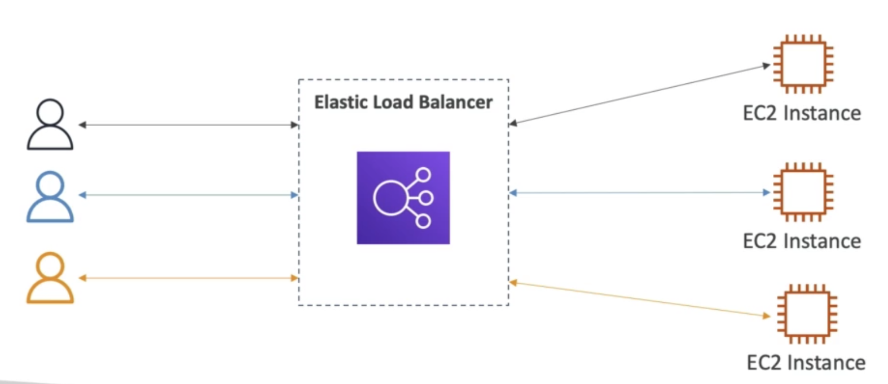

 

Elastic Load Balancer is a managed load balancer:

- AWS guarantees that it will be working
- AWS takes care of upgrades, maintenance and high availability
- AWS provides only a few configuration knobs

<ins>ELB costs less to setup your own load balancer but it will be a lot more effort on your end.</ins>

It is integrated with many AWS offerings / services:

- EC2, EC2 Auto Scaling Groups, Amazon ECS
- AWS Certificate Manager, CloudWatch
- Route53, AWS WAF, AWS Global Accelerator

 

---

 
 

## ELB Healthchecks

Is a way (technique) for elastic load balancers to verify whether or not an application/service is properly working, and if something is not properly working then they redirect all the traffic to “somewhere else“.

- Health Check are crucial for Load Balancers
- <ins>They enable the load balancer to know if instances it forwards traffic to are available to reply to requests</ins>
- The health check is done on a port and a rout (/health is common)

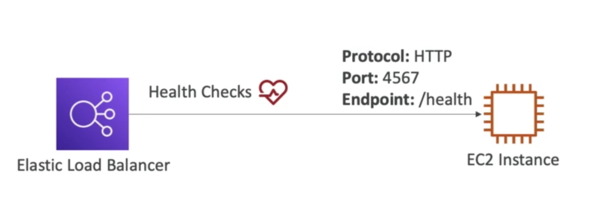

 

---

 
 

## Types of Load Balancers

AWS has 4 kinds of managed Load Balancers:

- **Classic Load Balancers** (v1 - old generation) - 2009 - CLB

  - HTTP, HTTPS, TCP, SSL (Secure TCP)

- **Application Load Balancer** (v2 - new generation) - 2016 - 2016 - ALB

  - HTTP, HTTPS, Websocket

- **Network Load Balancer** (v2 - new generation) - 2017 - NLB

  - TCP, TLS (Secure TCP), UDP

- **Gateway Load Balancer** - 2020 - GWLB
  - Operate at layer 3 (Network layer) - IP Protocol

### Some Important notes

_Overall, it is recommended to use the newer generation load balancers as they provide more features_.

_Some load balancers can be setup as internal (private) or external (public) ELB._

 

---

 
 

## Load Balancer Security Groups

<ins>In combination with Security Groups, you can set security rules that enhance your security mechanisms</ins> like “Only allow TCP connections that exclusively come from an existing Load Balancer (at Port 80)”.

At the same time you can configure an exclusive isolated Security rules (through Security Group) for that load balancer to allow connections at port 80 and 443.

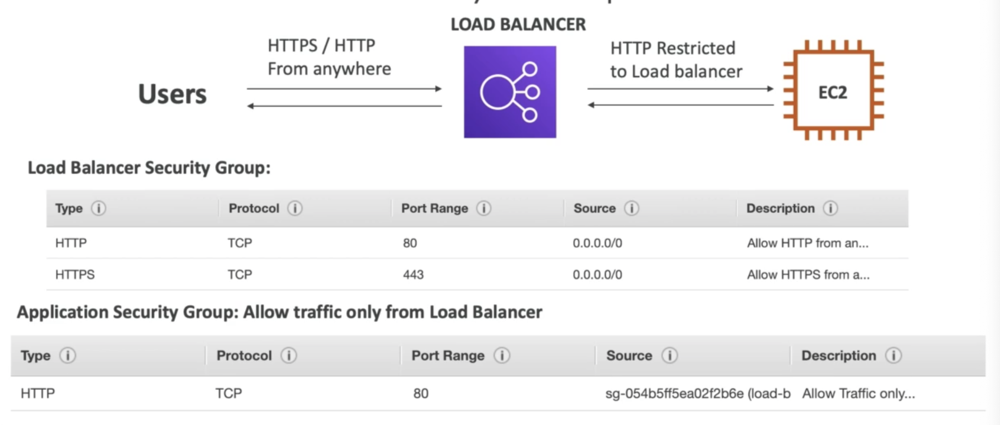

 

---

 
 

## ELB Types explained

### Classic Load Balancers - CLB

- Support TCP (Layer 4), HTTP & HTTPS (Layer 7)
- Health checks are TCP or HTTP based
- Fixed hostname (XXX.region.elb.amazonaws.com)

 
 
 
### Application Load Balancer (v2) - ALB

- Application Load Balancers is Layer 7 (HTTP)
- Load Balancing to multiple applications on the same machine (ex: containers)
- HTTP/2 and WebSocket support
- Support redirects (ex: from HTTP to HTTPS)

_Routing Tables Feature:_

- Routing tables to different target groups:
  - Routing based on path in URL (example.com/users & example.com/posts)
  - Routing based on hostname in URL (one.example.com & other.example.com)
  - Routing based on Query String, Headers (example.com/users?id=123&order=false)
- ALB are great fit for micro services & container-based application (ex: Docker & Amazon ECS)
- Has a port mapping feature to redirect to a dynamic port in ECS
- In comparison, we’d need multiple Classic Load Balancer per application

 

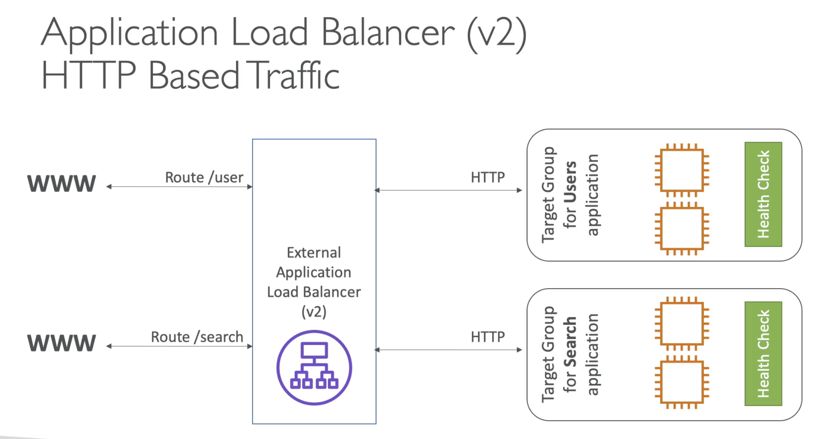

 

#### Target Groups Features

- EC2 instances (can be managed by Auto Scaling Group) - HTTP
- ECS tasks (managed by ECS itself) - HTTP
- Lambda functions - HTTP request is translated into a JSON event
- IP Addresses - Must be private IPs
- ALB can route to multiple target groups
- Health checks are at the target group level

#### Good to Know

- Fixed hostname (XXX.region.elb.amazonaws.com)
- The application servers don’t see the IP of the client directly
  - The true **IP of the client is inserted in the header X-Forwarded-For**
  - We can also get the **client Port (X-Forwarded-Port) and client protocol (X-Forwarded-Proto)**
  - These standard headers are part of some common test questions

 
 

### Network Load Balancer (v2)

NLB (Layer 4) allow to:

- Forward TCP & UDP traffic to your instances
- Handle millions of requests per seconds
- Less latency ~ 100 ms (vs 400 ms for ALB)

NLB has one static IP per AZ, and supports assigning Elastic IP (Helpful for whitelisting specific IP)

- NLB are used for extreme performance, TCP or UDP traffic
- <ins>Not included in the AWS free tier</ins>

 

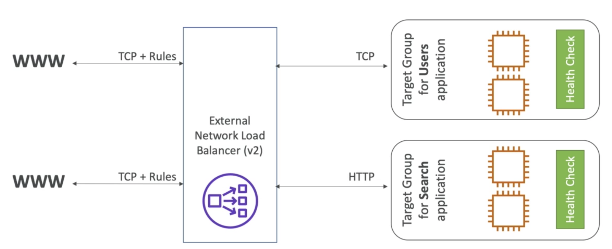

 

#### Target Groups Feature

- EC2 Instances
- IP Addresses - must be private IPS
- Application Load Balancers

 

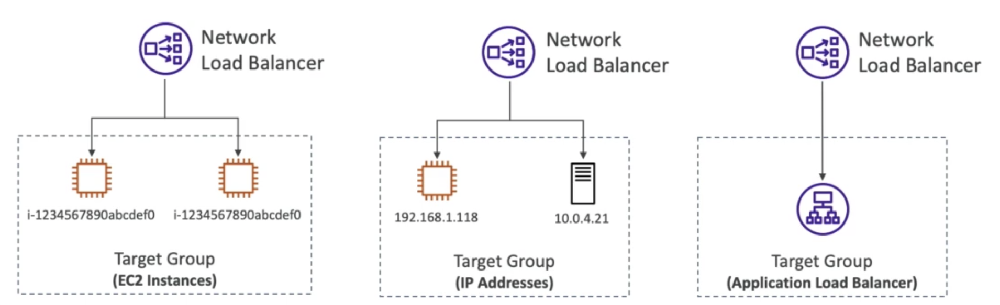

 

 

### Gateway Load Balancer

- Deploy, scale, and manage a fleet of 3rd party network virtual appliances in AWS
- Example: Firewalls, Intrusion, detection and prevention systems, deep packet inspection systems, payload manipulation,…
- Operates at layer 3 (Network Layer) - IP Packets
- Combines the following functions:
  - Transparent Network Gateway - Single entry/exit for all traffic
  - Load Balancer - distributes traffic to your virtual appliances
- Uses the [GENEVE protocol](https://www.redhat.com/en/blog/what-geneve) on port 6081

 

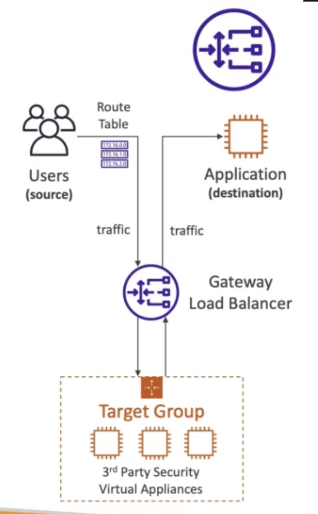

 

#### Target Groups Feature

- EC2 (Only) Instances
- IP Addresses - Must be private IPs

 

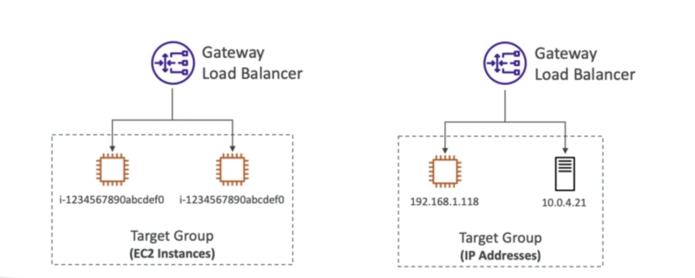

 

---

 
 

## ELB Sticky Sessions (Session Affinity)

- It is possible to implement stickiness so that the same client is always redirected to the same instance behind a load balancer
- This work for CLB (Classic LB) & ALB (Application LB)
- The “cookie” used for stickiness has an expiration date you control
- <ins>Use case: make sure the user doesn’t lose his session data</ins>
- <ins>Enabling stickiness may bring imbalance to the load over the backend EC2 instances</ins>

 

<!-- 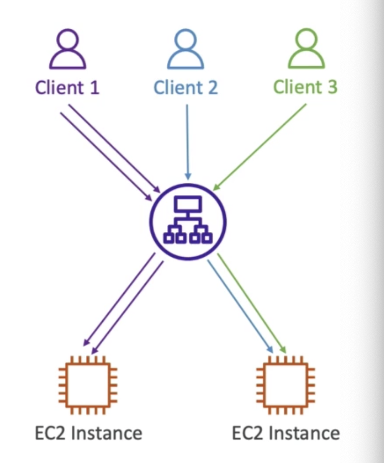 -->

 

### ELB Sticky Sessions Cookies

**Application-based Cookies:**

- Custom Cookie
  - Generated by the target
  - Can include any custom attributes required by the application
  - Cookie name must be specified individually for each target group
  - <ins>Don’t use AWSALB, AWSALBAPP, or AWSALBTG (since its reserved by AWS for the use by the ELB)</ins>

 

- **Application Cookie**
  - Generated by the load balancer
  - <ins>Cookie name is AWSALBAPP</ins>

 

**Duration-based Cookies:**

- Cookie generated by the load balancer
  - <ins>Cookie name is AWSALB for ALB, AWSELB, or CLB<ins>

 

---

 
 

## Cross-Zone Load Balancing

 

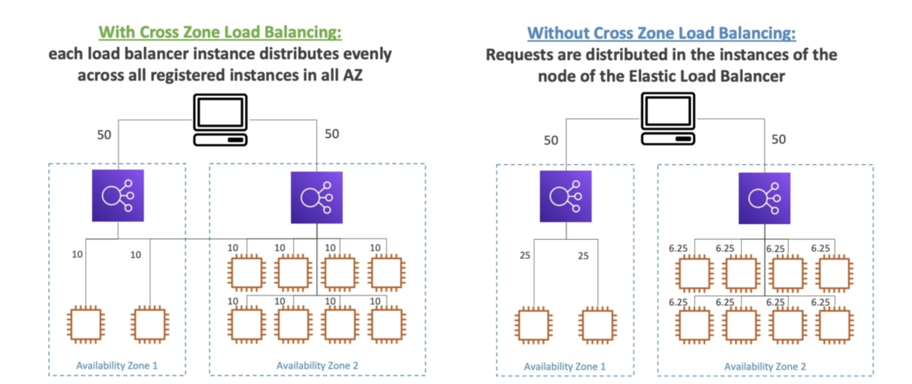

 

**In case of Application Load Balancer**

- Always on (can’t be disabled)
- No charges for inter AZ data

**In case of Network Load Balancer**

- Disabled by default
- You pay charges ($) for inter AZ data if enabled

**In case of Classic Load Balancer**

- Disabled by default
- No charges for inter AZ data if enabled

 

---

 
 

## SSL/TLS - Basics

<ins>An SSL Certificate allows traffic between your clients and your load balancer to be encrypted in transit (in-flight encryption)</ins>. [SSL refers to Secure Sockets Layer](https://www.kaspersky.com/resource-center/definitions/what-is-a-ssl-certificate), used to encrypt connections while TLS refers to Transport Layer Security, which is a newer and enhanced version:

    * Nowadays, TLS certificates are mainly used, but people still refer as SSL
    * Public SSL certificates are issued by Certificate Authorities (CA)
    * Comodo, Symantec, GoDaddy, GlobalSign, DigitCert, LetsEncrypt, etc.
    * SSL certificates have an expiration date (a lifespan you set) and must be renewed.

 

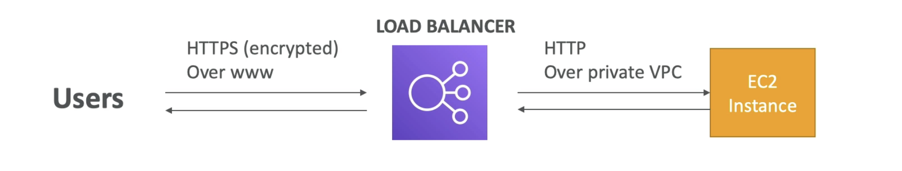

 

> The load balancer set an X.509 certificate (SSL/TLS server certificate) and you can manage certificates using ACM (AWS Certificate Manager). Additionally you can create and upload your own certificates.

In case of Load Balancer’s HTTP listeners feature :

- You must specify a default certificate
- You can add an optional list of certs to support multiple domains
- Clients can use SNI (Server Name Indication) to specify the hostname they reach
- Have the ability to specify a security policy to support older versions of SSL/TLS (Legacy clients)

 
 

### SNI - Server Name Indication

- [SNI solves the problem of loading multiple SSL certificates](https://en.wikipedia.org/wiki/Server_Name_Indication) onto one web server (to server multiple websites)
- It’s a “newer” protocol, and requires the client to indicate the hostname of the target server in the initial SSL handshake
- The server will then find the correct certificate, or return the default one

 

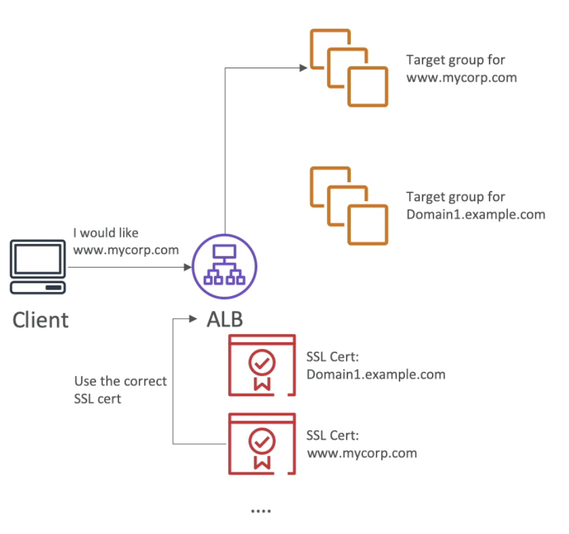

 

**Important Notes:**

- SNI Only works for ALB & NLB (newer generations) and CloudFront.

<ins>Classic Load Balancer (v1)</ins>

- Support only one SSL certificate
- Must use multiple listeners with multiple SSL certificates
- Uses SNI to make it work

<ins>Network Load Balancer (v2)</ins>

- Supports multiple listeners with multiple SSL certificates
- Uses SNI to make it work

 
 

### Connection Draining

**Feature Naming:**

- Connection Draining for CLB
- Deregistration Delay for ALB y NLB

<ins>Connection Draining is the time to complete “in-flight requests” while the instance is de-registering or in an unhealthy state.</ins>

- Stops sending new requests to the EC2 instances which is de-registering
- Between 1 to 3600 seconds (default 300)
- Can be disabled (set value to 0)
- Set to a low value if your requests are short

 

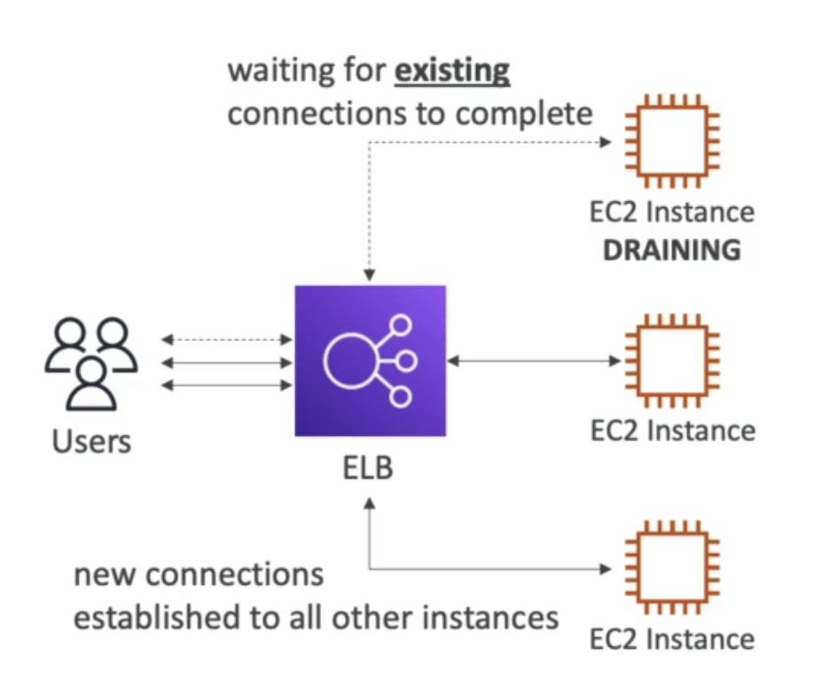

 

---

 

| Previous                         |     |     |     |     | Next                    |
| -------------------------------- | --- | --- | --- | --- | ----------------------- |
| [AWS EFS](../storage/aws-efs.md) |     |     |     |     | [AWS ASG](./aws-asg.md) |
