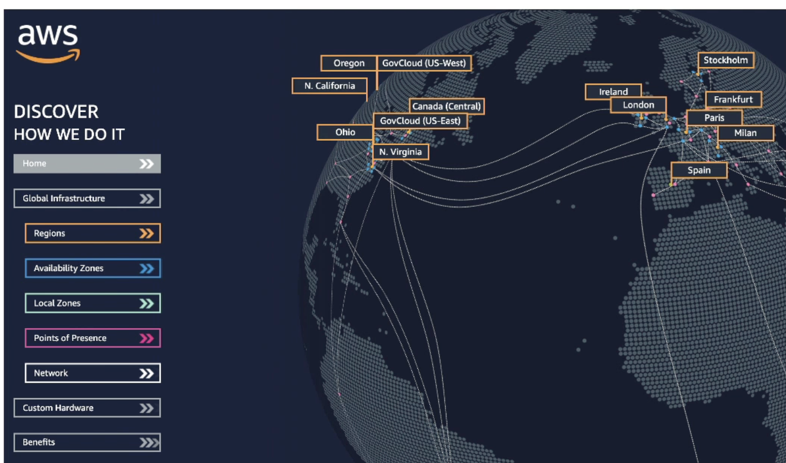
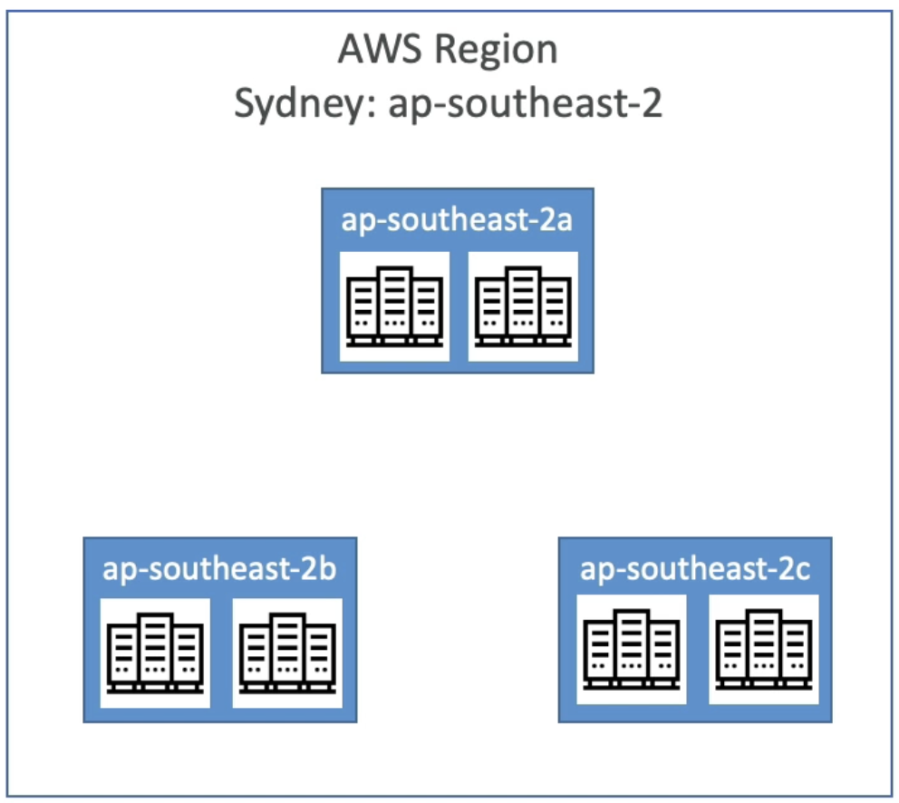
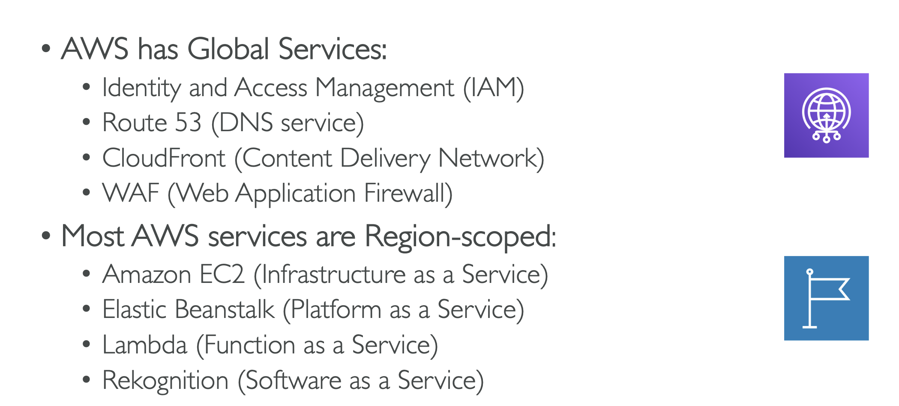

# AWS Certified Developer Associate Program DVA-C01

This credential helps organizations identify and develop talent with critical skills for implementing cloud initiatives. Earning AWS Certified Developer – Associate validates the ability to write and deploy cloud-based applications.

We encourage you to read more about this certfication, exigences and benefits:

- [Audacity - What you need to know to become an AWS developer](https://www.udacity.com/blog/2020/09/what-you-need-to-know-to-become-an-aws-developer.html)
- [CBTNuggets - Is the AWS DVA-01 Worth it?](https://www.cbtnuggets.com/blog/certifications/cloud/is-the-aws-developer-associate-worth-it)

This certification program counts with more than [x (WIP)] service modules.

# AWS Service introduction

AWS Provides a wide range of tools to make up one of the largest in the infrastructure as a service industry. It has data centers and other infrastructure globally.

- [AWS Certified Developer Associate Program DVA-C01](#aws-certified-developer-associate-program-dva-c01)
- [AWS Service introduction](#aws-service-introduction)
  - [AWS Regions](#aws-regions)
  - [AWS AZs](#aws-azs)
  - [AWS Points of Presence](#aws-points-of-presence)
  - [Regional vs Global Services](#regional-vs-global-services)
  - [TOC](#toc)

---

## AWS Regions

_"AWS has the concept of a region, which is a physical location around the world where we group data centers. We call each group of logical data centers an “availability zone”. Each AWS Region consists of several physically separate and isolated Availability Zones within a geographic area."_

- AWS has Regions all around the world (us-east-1, us-west-2, sa-east-1, etc.)
- Most AWS services are region-scoped (Se limita el uso (configuración) de servicio por región).

_How do we choose an AWS Region?_

- **Compliance**: With data governance and legal requirements: data never leaves a region without explicit permission.
- **Proximity**: Reduced latency to clients.
- **Available services**: Within a region new services and features aren’t available in every region.
- **Pricing**: Varies region to region and is transparent in the service pricing page.

---

## AWS AZs

_“An Availability Zone (AZ) is one or more discrete data centers with redundant power, networking, and connectivity in an AWS Region. Availability Zones allow customers to operate production databases and applications with greater availability, fault tolerance, and scalability than a single data center would provide.”
o”_

**Key concepts:**

- Each AZ is one or more discrete data centers with redundant power, networking and connectivity
- They’re separate from each other so that they’re isolated from disasters
- They’re connected with high bandwidth with ultra low latency
- [AWS Regions and AZs](https://aws.amazon.com/about-aws/global-infrastructure/regions_az/?p=ngi&loc=2)

---

## AWS Points of Presence

(Local Zones or Edge Locations)

_”AWS Points of Presence (PoP) or Local Zones locate compute, storage, database, and other select AWS services closer to end users. Each AWS Local Zone location is an extension of an AWS Region where you can run your latency-sensitive applications with AWS services (…)”_

For example, the POPs are used for both AWS `CloudFront` to deliver content to end users at high speeds, and `Lambda@Edge` to run Lambda functions with the lowest possible latency.

**Key Concepts:**

- Amazon has 216 Points of Presence (205 Edge Locations & 11 regional Caches) in 42 countries
- Content is delivered to end users with the lowest latency possible

## Regional vs Global Services

**Key concepts:**

- [See the complete list of regional services](https://aws.amazon.com/en/about-aws/global-infrastructure/regional-product-services/)
- [AWS Global infrastructure](https://aws.amazon.com/en/about-aws/global-infrastructure/)

## TOC

**This document is currently under construction (WIP)**

1. [AWS IAM](security/aws-iam.md)
2. [AWS PowerShell](security/powershell.md)
3. [AWS EC2](computing/aws-ec2.md)
4. [AWS EBS](storage/aws-ebs.md)
5. [AWS EFS](storage/aws-efs.md)
6. [AWS ELB](networking/aws-elb.md)
7. [AWS ASG](networking/aws-asg.md)
8. [AWS RDS](networking/aws-rds.md)
