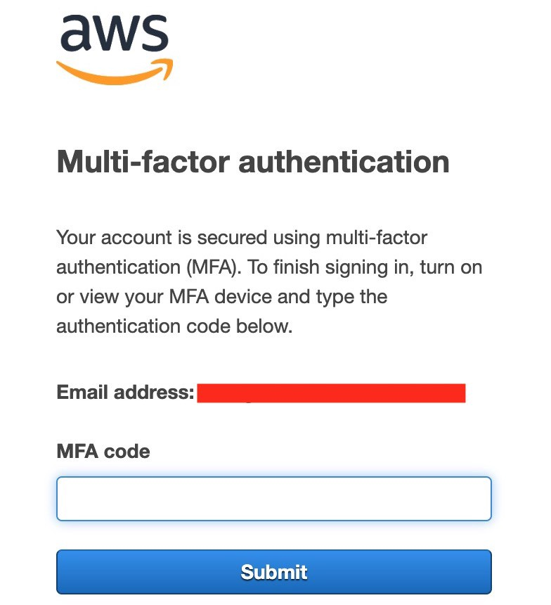

# AWS IAM

_“AWS Identity and Access Management (IAM) provides granular access control across AWS. With IAM, you can specify who can access what services and resources, and under what conditions. With IAM policies, manage the permissions of your staff and systems to ensure least privilege permissions.”_

IAM is a global service, with different powerful features in terms of security and administration of users and components of your infrastructure:
:

- IAM is an AWS feature with no charges (its free!).
- Root account created by default
- Users are people within you organization and can be grouped
- Groups only contain users, not other groups
- Users don’t have to belong to a group, and user can belong to multiple groups.
- More information at https://aws.amazon.com/es/iam/faqs/
- See complete docs of Identity and Access management at https://docs.aws.amazon.com/IAM/latest/UserGuide/id.html

## Identities

The AWS account root user or an IAM administrator for the account can create IAM identities. An IAM identity provides access to an AWS account.

An IAM identity represents a user, and can be authenticated and then authorized to perform actions in AWS. Each IAM identity can be associated with one or more policies. Policies determine what actions a user, role, or member of a user group can perform, on which AWS resources, and under what conditions.

---

## AWS Root account

When you first create an Amazon Web Services (AWS) account, you begin with a single sign-in identity that has complete access to all AWS services and resources in the account. This identity is called the AWS account root user and is accessed by signing in with the email address and password that you used to create the account.

> **NOTE:** AWS strongly recommend that you do not use the root user for your everyday tasks, even the administrative ones. Instead, adhere to the best practice of using the root user only to create your first IAM user.

---

## IAM Users

An IAM user is an entity that you create in AWS. The IAM user represents the person or service who uses the IAM user to interact with AWS. A primary use for IAM users is to give people the ability to sign in to the AWS Management Console for interactive tasks and to make programmatic requests to AWS services using the API or CLI.

_"A user in AWS consists of a name, a password to sign into the AWS Management Console, and up to two access keys that can be used with the API or CLI."_

---

## IAM User Groups

An IAM user group is a collection of IAM users. You can use user groups to specify permissions for a collection of users, which can make those permissions easier to manage for those users. For example, you could have a user group called Admins and give that user group the types of permissions that administrators typically need. Any user in that user group automatically has the permissions that are assigned to the user group.

---

## IAM Roles

An IAM role is very similar to a user, in that it is an identity with permission policies that determine what the identity can and cannot do in AWS. However, a role does not have any credentials (password or access keys) associated with it. Instead of being uniquely associated with one person, a role is intended to be assumable by anyone who needs it. An IAM user can assume a role to temporarily take on different permissions for a specific task.

---

## IAM Policies

_“You manage access in AWS by creating policies and attaching them to IAM identities (users, groups of users, or roles) or AWS resources. A policy is an object in AWS that, when associated with an identity or resource, defines their permissions.”_

**Key concepts:**

- Users or Groups can be assigned JSON documents called policies
- Policies have a well defined structure
- https://docs.aws.amazon.com/AWSEC2/latest/UserGuide/iam-policy-structure.html

---

## IAM Permissions

IAM Policies can be composed of different permissions or the permission can be specified and described by itself.

Permissions are specific access rules defined as JSON (called as “Statement”) documents and define permissions of IAM Identities.

> **SUPER important:** In AWS you apply the least privilege principle: don’t give more permissions than the user needs

---

## Temporary credentials in IAM

Temporary credentials are primarily used with IAM roles, but there are also other uses. You can request temporary credentials that have a more restricted set of permissions than your standard IAM user. This prevents you from accidentally performing tasks that are not permitted by the more restricted credentials. A benefit of temporary credentials is that they expire automatically after a set period of time. You have control over the duration that the credentials are valid.

---

## IAM MFA

AWS Highly recommends to secure the root account by using strong passwords plus MFA.

`MFA = Multi Factor Authentication`

Through IAM, different security aspects can be controlled, such as:

- User password strength and password expiration
- Integration of MFA two-factor authentication mechanisms

- If password is stolen or hacked the account is not compromised
- MFA Options
  - Virtual MFA Device (Google Authenticator, Auth, etc).
  - Universal 2ns Factor (U2F) Security kEY (e.g YubiKey)
  - Hardware Key Fob MFA Device (by Gemalto)
  - Hardware Key Fob MFA Device for AWS GovCloud (Only US, provided by SurePassID)
- See more MFA information at: https://aws.amazon.com/es/iam/features/mfa/

---

## IAM Access Keys

To Access to AWS, there are at least three options:

- AWS Management Console (User, Password + MFA)
- AWS Command Line Interface CLI (Access Key + Secret Key)
- AWS Software Development Kit - SDK (Access Key + Secret Key)

**Key concepts:**

- **AWS CLI**: A powerful tool that enables you to interact with all AWS services using command in your command-line shell https://github.com/aws/aws-cli

- **AWS SDK**: Enables you yo access and manage was services programmatically embedded within your application (JS, Py, PHP, .NET, Java, Go, NodeJS, Android, iOS, Embedded C, Arduino, etc)

---

## IAM Roles for services

_"Some AWS Service will need to perform actions on your behalf, to do so, we will assign permissions to AWS services to IAM Roles"_

IAM Common Roles:

- EC2 Instance Roles
- Lambda Function Roles
- Roles for CloudFormation

---

## IAM Security Tools

IAM Credentials Report (account-level)

- A report that list all your accounts users and the status of their various credentials
- [Get credentials report for your account](https://docs.aws.amazon.com/IAM/latest/UserGuide/id_credentials_getting-report.html)

IAM Access Advisor (user-level)

- Access advisor shows the service permissions granted to an user and when those services were last accessed
- You can use this info to revise your policies
- [IAM Access Advisor article](https://aws.amazon.com/about-aws/whats-new/2019/06/now-use-iam-access-advisor-with-aws-organizations-to-set-permission-guardrails-confidently/?nc1=h_ls)

---

## IAM Guidelines & Best Practices

- Don’t use root account except for AWS account setup
- One physical user = one AWS user
- Assign users to groups and assign permissions to groups
- Create a strong password policy
- Use and enforce the use of Multi Factor Authentication (MFA)
- Create and use Roles for giving permissions to AWS Services.
- Use Access Keys for Programmatic Access (CLI/SDK)
- Audit permissions of your account with the IAM Credentials Report
- Never share IAM users and Access Keys
