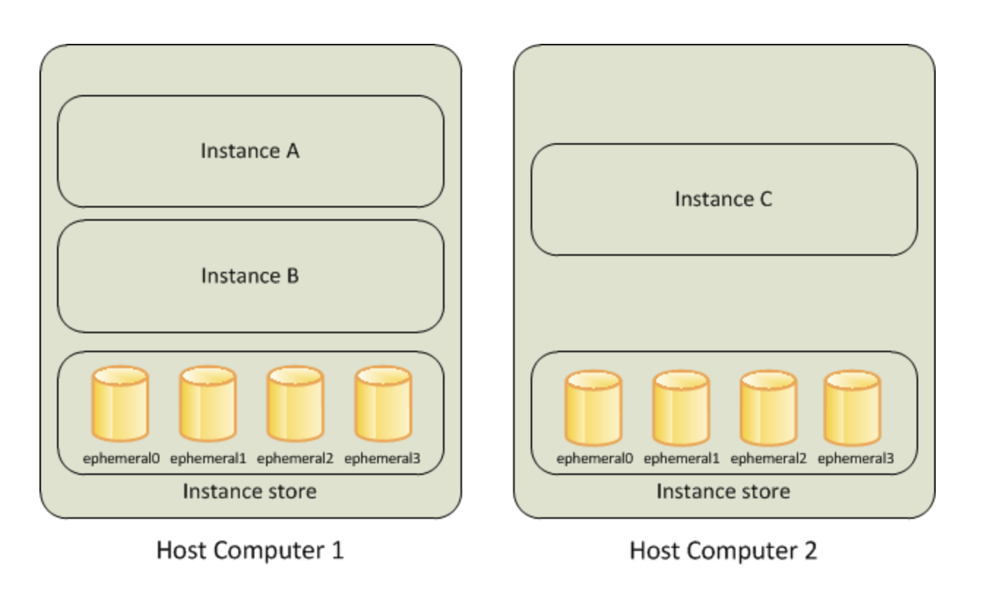
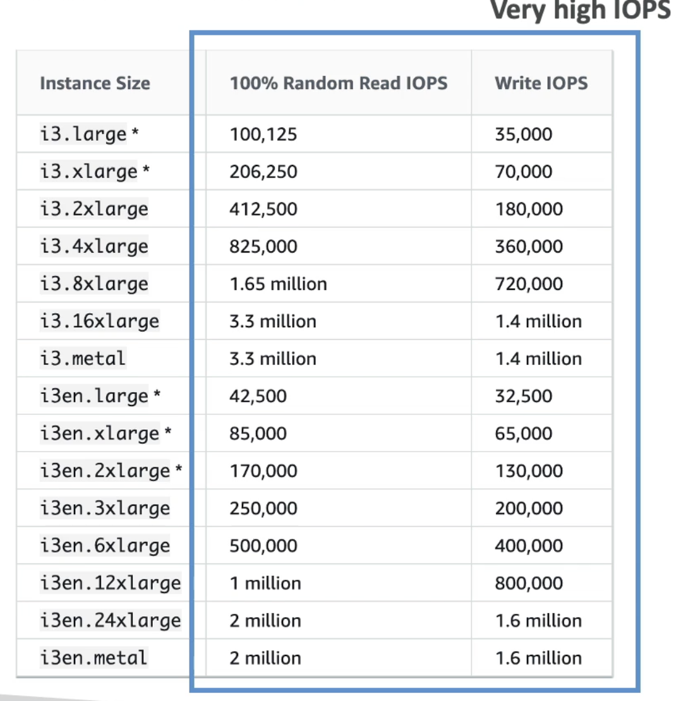
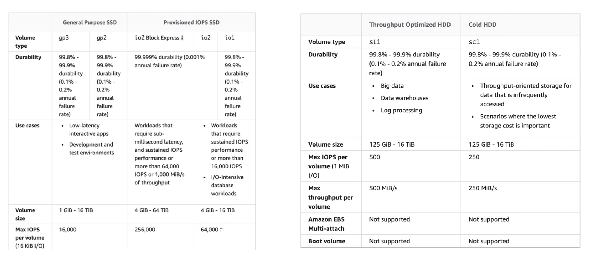
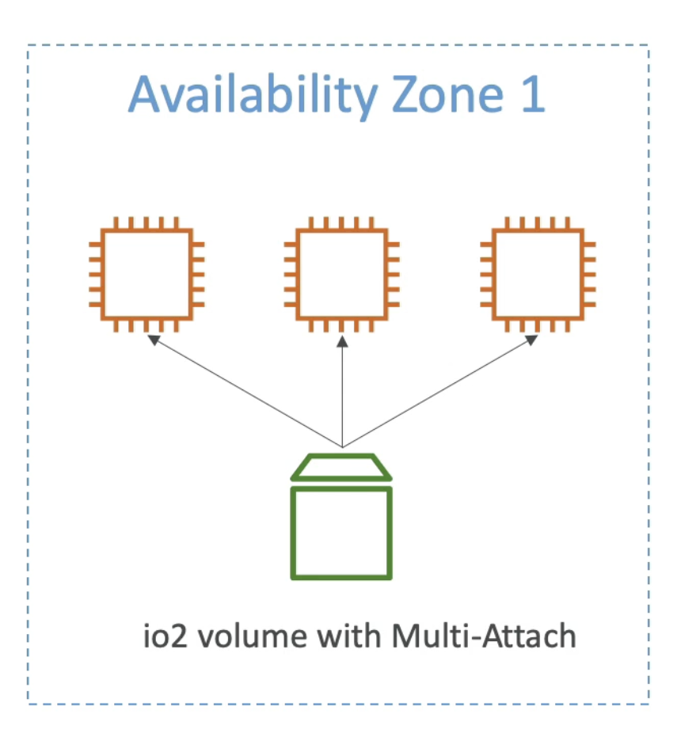

# Amazon EBS

_“Amazon Elastic Block Store (Amazon EBS) is an easy-to-use, scalable, high-performance block storage service designed for Amazon Elastic Compute Cloud (Amazon EC2).”._

- EBS is a network drive you can attach to your instances quile they run
- It allows your instances to persist data, even after termination
- They can only be mounted to one instance at a time (at CCP level)
- They are bound to a specific availabilty zone

**Free tier is 30 gb of free EBS storage of type general purposes (SSD) or magnetic per month.**

 

---

 
 

## 💾 EBS Volume

Its a network drive which means (its not a physical drive) it uses network to communicate to the instances, which means there might be a bit of latency

- EBS volume can be detached from EC2 instance and attached to another quickly
- Its locked to an AZ (volume created in us-east-1 cannot be attached to us-west-2 instance)
- To move a volume you first need to snapshot it
- Have a provisioned capacity (GBs and IOPs)

Additionally:

- You get billed for all the provisioned capacity
- You can increase volumes capacity over time
- Make a backup (snapshot) of your EBS Volume at any point of time
- Not necessary to detach volume to do snapshot, but recommended
- Can copy snapshots across AZ or region (useful when you want to distribute certain volumes across AZ/Region)

 

---

 
 

## 💾 EC2 Instance Store

_“An instance store provides temporary block-level storage for your instance. This storage is located on disks that are physically attached to the host computer. Instance store is ideal for temporary storage of information that changes frequently, such as buffers, caches, scratch data, and other temporary content.”._

 

 

- EBS Volumes are network drives with good but “limited” performance
- If you need a high-performance hardware disk, use EC2 Instance Store
- Better I/O performance
- EC2 Instance Store lose their storage if they’re stopped (ephemeral storage)
- Good for buffer/cache/scratch data/temporary content
- <ins>Risk of data loss if hardware fails</ins>
- <ins>Backups and replication are your responsibility!</ins>

 

 

**Instance Store lifetime:**

- The underlying disk drive fails
- The instance stops
- The instance hibernates
- The instance terminates

 

---

 
 

## 🧭 EBS Volume Types Use Cases

**General Purpose SSD (gp3/gp2):**

- For data that need to be accessed in miliseconds
- For low latency and interactive apps
- Development or test environments

**Provisioned IOPS SSD (io1/io2):**

- for sub milliseconds latency
- sustained IOPS performance
- 16K IOPS (or more)
- I/O-intensive database workloads
- 4GiB to 16 TiB

**Troughput Optimized HDD (st1):**

- Cannot be a boot volume
- 125 MiB to 16 TiB
- Throughput Optimized HDD (stl)
  - Big Data, Data Warehouses, Log Processing
  - Max throughput 500 MiB/s - max IOPS 500

**Cold HDD (sc1):**

- For data that is infrequently accessed
- Scenarios where lower cost is important
  - Max throughput 250 MiB/s - max IOPS 250

 

---

 
 

## 🌐 EBS Multi-attach - io1/io2 families

- Attach the same EBS Volume to multiple EC2 instances in the same AZ
- Each instance has full read & write permissions to the volume
- Use case:
  - Achieve higher application availability in clustered linux applications (ex: Teradata)
  - Applications must manage concurrent write operations
- Must use a file system that’s cluster-aware (not XFS, EX4, etc)

 

 

---

 

| Previous                           |     |     |     |     | Next                    |
| ---------------------------------- | --- | --- | --- | --- | ----------------------- |
| [AWS EC2](../computing/aws-ec2.md) |     |     |     |     | [AWS EFS](./aws-efs.md) |
