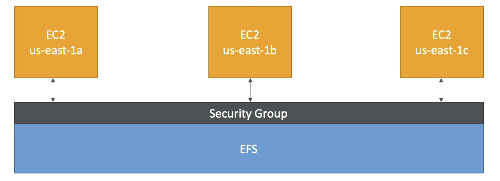
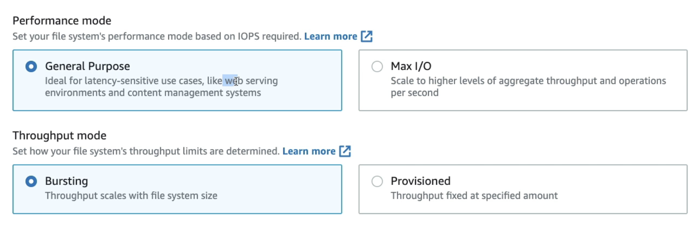
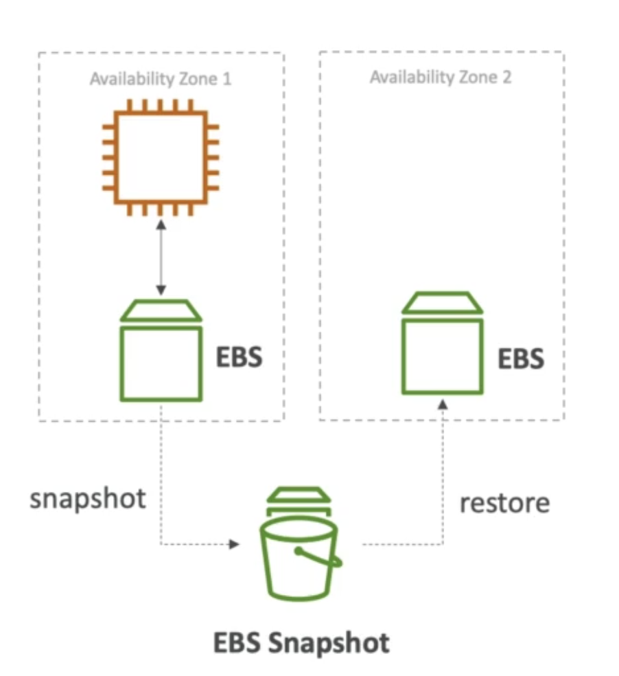
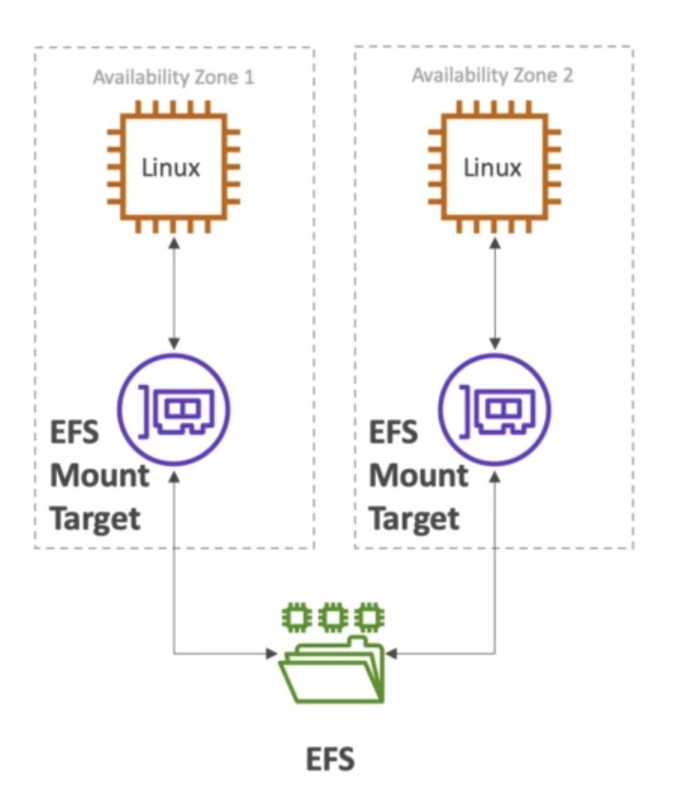

# Amazon EFS

_“Amazon Elastic File System (Amazon EFS) provides a simple, serverless and convenient elastic file system that allows you to share file data without the need to provision or manage storage. It can be used with AWS services and on-premises resources and is designed to scale on demand to petabytes without disrupting applications.”._

- Managed NFS (Network File System) that can be mounted on many EC2
- EFS works with EC2 instances in multi-AZ
- High available, scalable, expensive (3x gp2), pay per use

Use cases: content management, web serving, data sharing, Wordpress, etc.

- **Uses NFSv4.1 protocol**
- <ins>Uses security group to control access to EFS</ins>
- <ins>Compatible with Linux based AMI (not windows)</ins>
- Encryption at rest using KMS

Additionally:

- Based on _POSIX file system (Linux)_ <ins>that has a standard file API</ins>
- File System scales automatically, pay-per-use, no capacity planning

 

---

 
 

## 🏷️ EFS Features

- **EFS Scale**

  - 1000s of concurrent NGS clients, 10GB+ throughput
  - Grow to petabyte-scale network file system, automatically

 

- **Performance mode (set at EFS creation time)**

  - General purpose (by default): latency-sensitive use cases (web server, CMS, etc…)
  - Max I/O - higher latency, throughput, highly parallel (big data, media processing)

 

- **Throughput mode**

  - Bursting (1 TB = 50MiB/s + burst of up to 100 MiB/s)
  - Provisioned: set your throughput regardless of storage size, ex: 1GiB/s for 1 TB storage

 

- **Storage Tiers (lifecycle management feature - move file after N days)**
  - Standard: for frequent accessed files
  - Infrequent access (EDS-IA): cost to retrieve files, lower price store

 

 

---

 
 

## ⚔️ EFS vs EBS

### EBS Volumes

- <ins>Can be attached to only one instance at a time</ins>
- <ins>Are locket at the AZ level</ins>
- Gp2: IO increases if the disk size increases
- Io1: can increase IO independently
- To migrate an EBS Volume across AZ
  - Take a snapshot
  - Restore the snap to another AZ
  - EBS backups use IO and you should run them while your application is handling a lot of traffic.
- <ins>Root EBS Volumes of instances get terminated by default if the EC2 instance gets terminated (you can disable this behavior)</ins>

 

 

### Amazon EFS

- Mounting 100s of instances across AZ
- EFS share website files
- Only for LINUX instances
- Has a higher price point than EBS (3x)
- Can leverage EFS-IA for cost savings

 

 

---

 
 

## ✍️ IMPORTANT TEST NOTES

- When creating EC2 instances, you can only use the following EBS volume types as boot volumes: gp2, gp3, io1, io2, and Magnetic (Standard).

- Using EBS Multi-Attach, you can attach the same EBS volume to multiple EC2 instances in the same AZ. Each EC2 instance has full read/write permissions.

- EBS gp3 & gp2 (General Purpose SSD) increases its IOPS capacity if the disk size increases

- EBS gp3 & gp2 (General Purpose SSD) volume types reach IOPS peaks at 16,000 IOPS (max IOPS per volume) or equivalent 5334 GB.

- EBS io2 & io1 (Provisioned IOPS SSD) have provisioned IOPS capacity, so it can increase independently.

- EBS io2 & io1 (Provisioned IOPS SSD) can handle 64,000 IOPS (at its max capacity).

- EBS io2 Block Express can reach 256,000 IOS, and its designed for sub-millisecond latency workloads

- You can run a database on an EC2 instance that uses an Instance Store, but you'll have a problem that the data will be lost if the EC2 instance is stopped (it can be restarted without problems). One solution is that you can set up a replication mechanism on another EC2 instance with an Instance Store to have a standby copy. Another solution is to set up backup mechanisms for your data. It's all up to you how you want to set up your architecture to validate your requirements. In this use case, it's around IOPS, so we have to choose an EC2 Instance Store.

 

---

 
 

| Previous                |     |     |     |     | Next                                            |
| ----------------------- | --- | --- | --- | --- | ----------------------------------------------- |
| [AWS EBS](./aws-ebs.md) |     |     |     |     | [AWS ELB & ASG](./../networking/aws-elb-asg.md) |
